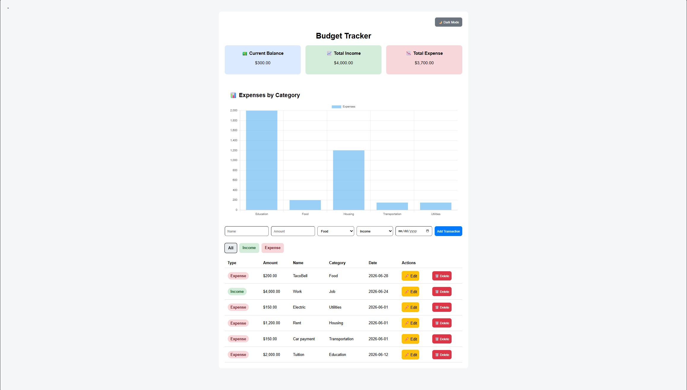
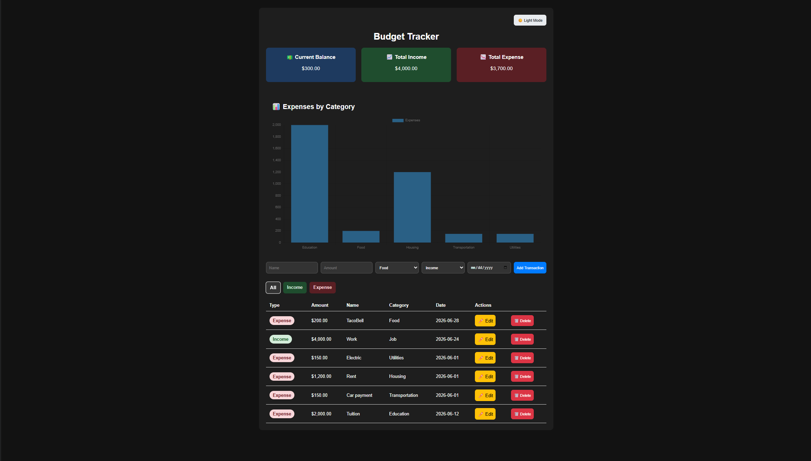
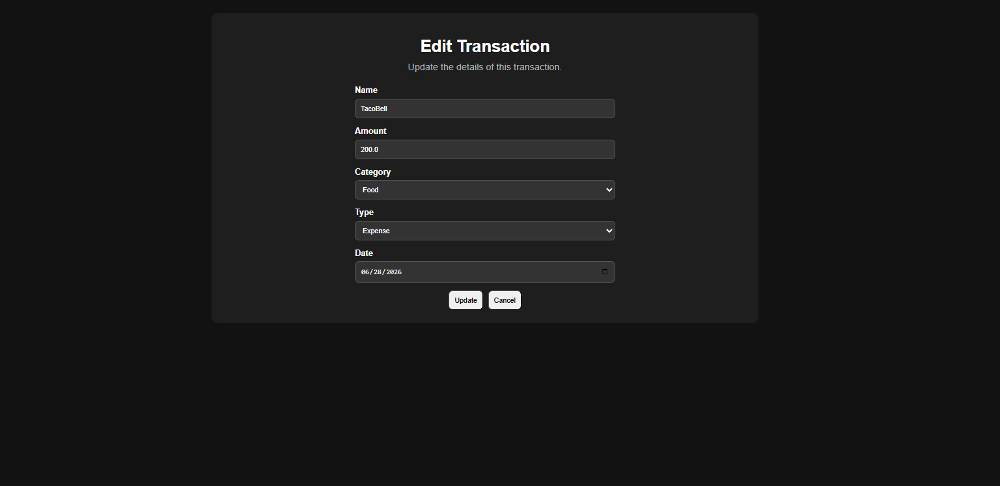

# Budget Tracker v1.0

A full-stack personal finance web application built with Flask and SQLite that allows users to manage income and expenses, visualize spending habits, and track financial information through an intuitive dashboard.

## Features

- Add new transactions
- Edit existing transactions
- Delete transactions
- View current balance
- View total income and expenses
- Filter transactions by type
- Visualize spending by category with charts
- Dark mode with saved preferences
- Currency formatting
- Responsive and modern user interface
- Persistent data storage using SQLite

## Technologies Used

### Backend
- Python
- Flask
- SQLite

### Frontend
- HTML
- CSS
- JavaScript
- Jinja2 Templates
- Chart.js

## Screenshots

### Light Mode


### Dark Mode


### Edit Transaction Page


## Installation

Clone the repository:

```bash
git clone https://github.com/D0ct0rg/budget-tracker-flask.git
```

Navigate to the project directory:

```bash
cd budget-tracker
```

Install dependencies:

```bash
pip install flask
```

Run the application:

```bash
python app.py
```

Open your browser and navigate to:

```text
http://127.0.0.1:5000
```

## Version History

### v1.0
- Full CRUD functionality
- Dashboard statistics
- Dark mode support
- Transaction filtering
- Expense chart visualization
- UI improvements and animations

## Author

Isaiah Cook